<div align="center">

# ZEPLAY

### Production-Oriented Adaptive Video Streaming Platform

A full-stack streaming platform engineered around adaptive video delivery, background transcoding, high-performance APIs, caching, database optimization, security, and measured concurrency.

`React` · `TypeScript` · `FastAPI` · `PostgreSQL` · `Redis` · `FFmpeg` · `HLS.js` · `k6`

</div>

---

<p align="center">
  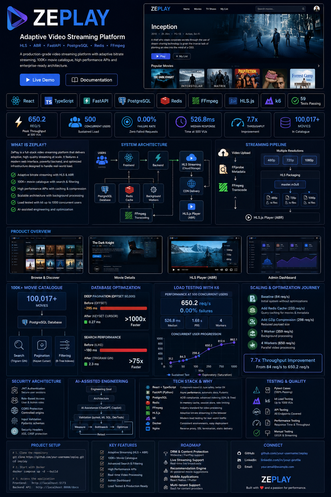
</p>


---

## Engineering Snapshot

<div align="center">

|       ⚡ Throughput       | 👥 Concurrent Load |         🎬 Catalogue         |       🧪 Tests      |
| :----------------------: | :----------------: | :--------------------------: | :-----------------: |
|      **650.2 req/s**     |     **500 VUs**    |      **100,017 movies**      | **59 / 59 passing** |
| 4-worker cached workload |   0.00% failures   | PostgreSQL benchmark dataset |    Backend suite    |

|    📊 P95   | 🚀 Throughput Gain |      🎞️ Streaming      |  🗄️ Deep Pagination  |
| :---------: | :----------------: | :---------------------: | :-------------------: |
| **1.684 s** |      **7.7×**      | **480p / 720p / 1080p** | **~295 ms → 0.27 ms** |
|  At 500 VUs | 84.2 → 650.2 req/s |       Adaptive HLS      |     SQL execution     |

</div>

> Benchmark numbers represent measured development/benchmark environments. They are not projected production capacity.

---

# What is ZePlay?

ZePlay is a production-oriented video streaming platform developed during a Software Engineering Internship.

The project started as a full-stack streaming application and evolved into an engineering study of the systems behind modern video platforms.

ZePlay focuses on:

* Adaptive video streaming
* HLS media delivery
* Background transcoding
* Database scalability
* Caching
* API performance
* Authentication and authorization
* Premium content protection
* Search and recommendations
* High-concurrency testing
* Query optimization
* Horizontal scaling
* Production infrastructure design

The goal was not to reproduce another streaming service's interface.

The goal was to understand and implement the engineering required behind one.

---

# Engineering Priorities

ZePlay was developed around this priority order:

```text
1. Availability
2. Scalability
3. Speed
4. Security
5. Streaming Performance
6. Features
```

This affected architectural decisions throughout development.

Features were not treated as complete until their performance, security, streaming behaviour, or scalability implications had been considered.

---

# System Architecture

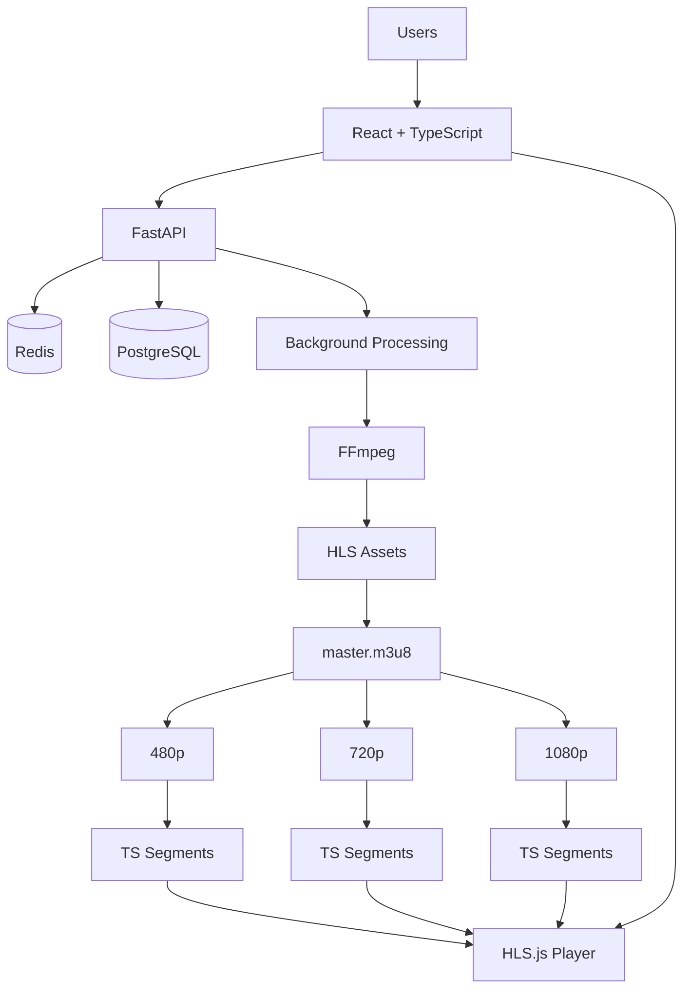

ZePlay separates different workloads instead of forcing one server component to perform every task.

### Frontend

React and TypeScript handle the interactive application.

### API

FastAPI handles application logic, authentication, authorization, metadata, profiles, history, recommendations, and administrative operations.

### Database

PostgreSQL stores durable relational data.

### Cache

Redis serves frequently requested application data with lower latency.

### Media Processing

FFmpeg performs CPU-intensive video transcoding and HLS generation.

### Playback

HLS.js handles adaptive HLS playback in the browser.

---

# Streaming Architecture

A basic streaming implementation might expose:

```text
movie.mp4
```

and let the browser request the file.

ZePlay instead prepares media for adaptive segmented streaming.

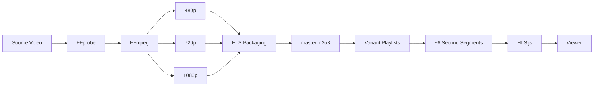

The result looks conceptually like:

```text
master.m3u8
│
├── 480p/
│   ├── playlist.m3u8
│   ├── segment001.ts
│   ├── segment002.ts
│   └── ...
│
├── 720p/
│   ├── playlist.m3u8
│   └── ...
│
└── 1080p/
    ├── playlist.m3u8
    └── ...
```

---

# Why HLS?

HLS was selected because ZePlay requires more than simple video playback.

The platform needs:

* Adaptive bitrate streaming
* Efficient seeking
* Multiple quality levels
* Progressive segment delivery
* Network adaptation
* CDN-friendly media distribution
* Manual quality switching

Direct MP4 delivery works for simpler playback scenarios but does not provide ZePlay's adaptive streaming architecture as naturally.

MPEG-DASH provides similar adaptive capabilities and would also be a valid architecture.

HLS fits ZePlay well because of its ecosystem, browser support through HLS.js, segmented architecture, and CDN compatibility.

---

# Adaptive Bitrate Streaming

ZePlay produces:

```text
1080p
720p
480p
```

HLS.js uses these variants for adaptive playback.

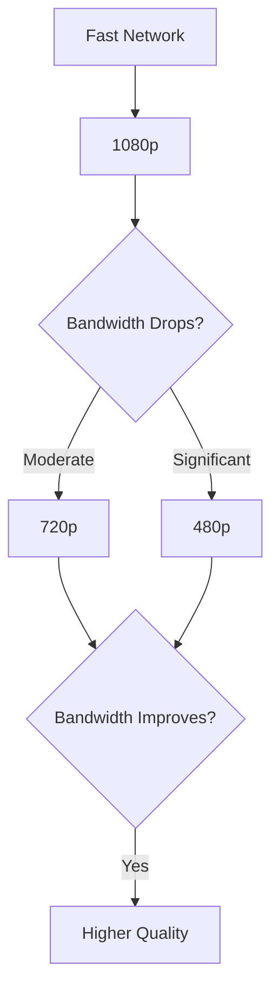

The goal is playback continuity.

A lower quality stream that continues playing is preferable to a high-quality stream that constantly buffers.

Users also receive manual controls:

```text
Auto
1080p
720p
480p
```

This gives users control while also making each rendition easy to validate during testing.

---

# Seeking and Segment Delivery

ZePlay uses approximately six-second media segments.

For a 90-minute video:

```text
90 minutes
× 60
= 5,400 seconds

5,400 / 6
≈ 900 segments
```

If the viewer seeks to a later position, the player requests segments around the new playback point.

It does not need to sequentially download every earlier segment.

Seeking was validated around:

```text
0%
25%
50%
75%
95%
```

Browser DevTools was used to verify playlist and segment traffic.

---

# Video Processing Pipeline

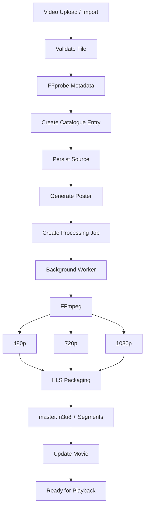

A custom import workflow was also created for large local video files.

This avoids relying exclusively on browser uploads during development.

---

# Why FFmpeg?

FFmpeg is responsible for media transformation.

ZePlay uses it for:

* Video transcoding
* Resolution conversion
* H.264 encoding
* AAC audio
* HLS segmentation
* Keyframe control
* Poster extraction

Building a custom video encoder would add enormous complexity without improving the project.

Alternatives include GStreamer and managed cloud transcoding services.

FFmpeg fits ZePlay because it provides mature codec support, direct command-line automation, HLS support, and full control over the processing pipeline.

---

# Why FFprobe?

FFprobe inspects media before processing.

It retrieves information such as:

```text
Duration
Resolution
Video codec
Audio codec
Frame rate
Streams
```

FFmpeg transforms media.

FFprobe inspects media.

Using separate tooling for these jobs keeps the ingestion pipeline clearer.

---

# Background Processing

Video transcoding is expensive.

The API should not wait for the entire process.

Bad flow:

```text
Upload
↓
HTTP Request
↓
Transcode 1080p
↓
Transcode 720p
↓
Transcode 480p
↓
Generate HLS
↓
Return Response
```

ZePlay instead follows:

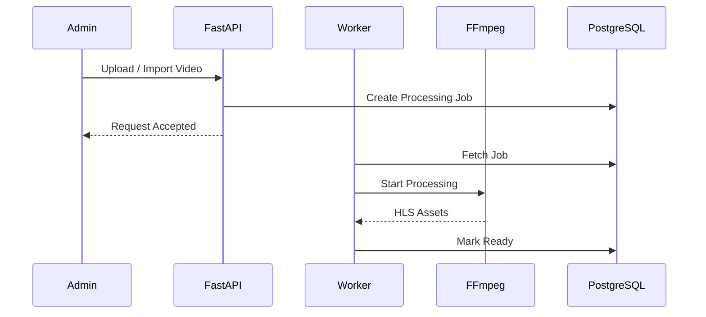

This isolates CPU-heavy media work from normal API traffic.

---

# Frontend Stack

## React

React builds ZePlay's interactive interface.

It handles areas such as:

```text
Home
Browse
Search
Movie Details
Profiles
Player
Authentication
Admin
```

### Why React?

ZePlay has reusable, stateful UI components and many asynchronous interactions.

React provides a component model suited to this workload.

Alternatives include Vue and Angular.

Vue would also work well.

Angular provides a more complete framework with stricter structure.

React fits ZePlay because of its ecosystem, reusable component model, TypeScript support, and HLS.js integration.

---

## TypeScript

TypeScript adds static typing to JavaScript.

ZePlay handles structured data such as:

```text
Movie
User
Profile
Watch History
Rating
Subscription
API Responses
Player State
```

Static types make refactoring and maintaining these interfaces safer.

### Why not plain JavaScript?

JavaScript remains the language executed by the browser.

TypeScript adds compile-time type checking before producing JavaScript.

For a growing application, this reduces a class of runtime mistakes and improves editor tooling.

---

## Vite

Vite provides ZePlay's frontend development server and production build process.

### Why Vite?

It provides:

* Fast development startup
* Hot Module Replacement
* TypeScript integration
* React support
* Production bundling

Webpack is a mature alternative with extensive configuration options.

Vite fits ZePlay because the project does not need the additional configuration overhead of a custom Webpack setup.

---

## React Query

React Query manages server state.

It helps with:

* API response caching
* Loading state
* Error state
* Request deduplication
* Refetching
* Cache invalidation

### Why not only `useEffect` and `useState`?

Those hooks work for individual requests.

At application scale, manually implementing cache freshness, retries, duplicate request handling, and invalidation across many screens becomes repetitive.

React Query centralizes those concerns.

---

# Backend Stack

## Python

Python is the primary backend language.

### Why Python?

ZePlay combines:

* Web APIs
* Database access
* Background jobs
* FFmpeg automation
* Testing
* Benchmark tooling

Python has strong libraries across these areas and supports rapid development.

Java with Spring Boot would be a strong alternative for a large enterprise backend.

Node.js would also fit API-heavy workloads.

Python fits ZePlay because FastAPI and the media-processing workflow integrate cleanly while keeping backend tooling in one ecosystem.

---

## FastAPI

FastAPI provides the application API.

It handles:

```text
Authentication
Movies
Profiles
Search
Recommendations
History
Watchlists
Ratings
Subscriptions
Admin Operations
```

### Why FastAPI?

ZePlay benefits from:

* Async request handling
* Python type hints
* Request validation
* OpenAPI documentation
* Strong SQLAlchemy integration
* Media-processing ecosystem compatibility

### Why not Flask?

Flask is lightweight but requires more manual assembly for many API features.

### Why not Django?

Django provides a broader full-stack framework.

ZePlay already uses React for the frontend and SQLAlchemy for persistence, so an API-focused framework fits better.

---

# PostgreSQL

PostgreSQL is the primary relational database for the production-oriented architecture.

It stores:

```text
Users
Profiles
Movies
Genres
Videos
Ratings
Watch History
Watchlists
Subscriptions
Media References
```

### Why PostgreSQL instead of SQLite?

SQLite was useful during development because it requires little setup.

PostgreSQL is better suited to ZePlay's target architecture because it supports:

* Concurrent clients
* Advanced indexing
* Transactions
* Query planning
* Connection pooling
* Production server workloads

---

# SQLAlchemy

SQLAlchemy provides the ORM and database-access layer.

```text
Python Model
     ↓
SQLAlchemy
     ↓
PostgreSQL
```

### Why use an ORM?

An ORM reduces repetitive database mapping code and provides reusable relationships, transactions, and query composition.

Raw SQL remains useful for performance analysis and specialized queries.

The project uses the ORM for maintainability while still inspecting PostgreSQL itself during optimization.

---

# Alembic

Alembic manages schema migrations.

```text
Application Model Changes
          ↓
Alembic Migration
          ↓
Database Schema Version
```

### Why?

Production databases should not rely on manual schema editing.

Migrations make structural changes repeatable and trackable.

Alembic fits ZePlay because it integrates directly with SQLAlchemy.

---

# 100K Catalogue Benchmark

Small datasets hide database problems.

ZePlay was scaled to:

<div align="center">

## 100,017 Movies

</div>

```text
100,000 generated benchmark movies
       17 real catalogue movies
────────────────────────────────
100,017 total
```

This dataset was used to test:

* Search
* Filtering
* Pagination
* Indexing
* Query plans
* API performance
* PostgreSQL concurrency

Integrity checks ensured the benchmark dataset did not break existing application relationships.

---

# Database Optimization

## Deep Pagination

Traditional OFFSET pagination:

```sql
LIMIT 40 OFFSET 50000
```

forces PostgreSQL to process earlier rows before discarding them.

At large offsets, this becomes expensive.

ZePlay added keyset pagination.

### Measured SQL Execution

```text
OFFSET 50,000

████████████████████████████████████████  ~295 ms


KEYSET CURSOR

▏ 0.27 ms
```

### Improvement

<div align="center">

## >1000× faster SQL execution

for the measured deep-pagination case.

</div>

Keyset pagination works by requesting records after a known cursor instead of asking the database to repeatedly skip large numbers of rows.

---

# Search Optimization

Partial text search behaves differently from exact lookup.

ZePlay uses PostgreSQL trigram indexing for catalogue title searches.

```text
Search
  │
  ▼
Trigram GIN Index
  │
  ▼
Matching Movies
```

Measured search averages after optimization:

| Workload    |  Average |
| ----------- | -------: |
| Prefix      | 13.43 ms |
| Substring   |  9.47 ms |
| Common term |  9.10 ms |
| Rare term   |  9.18 ms |
| No result   |  9.23 ms |
| Suggestions |  8.99 ms |

Combined title + genre SQL execution improved from approximately:

```text
262 ms
  ↓
48.19 ms
```

---

# Why PostgreSQL Indexes?

Without useful indexes:

```text
Query
 ↓
Scan large number of rows
 ↓
Find matches
```

With the correct index:

```text
Query
 ↓
Index
 ↓
Relevant rows
```

ZePlay uses indexing based on actual query patterns.

This includes:

* B-tree indexes
* Composite indexes
* Trigram GIN indexes

### Why not index everything?

Indexes consume storage and increase write cost.

They should support real access patterns rather than being added indiscriminately.

---

# Redis

Redis provides fast shared caching.

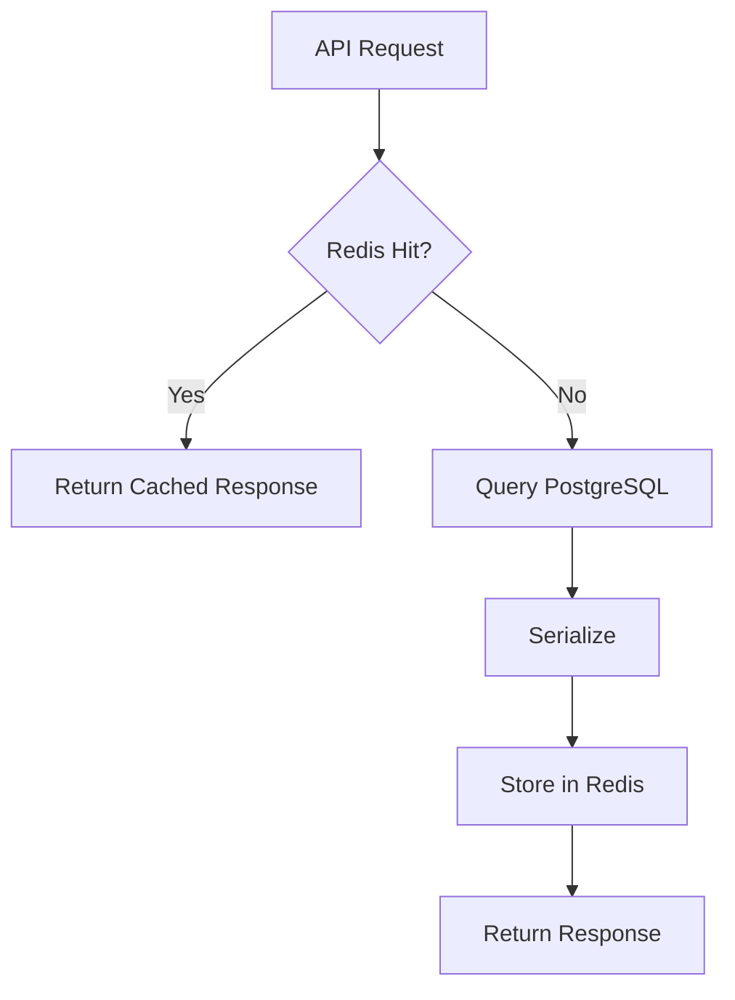

### Why Redis?

PostgreSQL is durable storage.

Redis solves a different problem.

Frequently requested data does not need to repeat the same database and serialization work on every request.

Redis reduces:

* Database pressure
* Repeated computation
* Response latency

An in-process cache would be faster for one process but would not naturally share state across multiple API workers.

Redis provides shared cache state.

---

# Pre-Serialized Cache Optimization

A normal cache hit still performed work:

```text
Redis
↓
JSON Decode
↓
Python Objects
↓
Validation
↓
JSON Encode
↓
Response
```

ZePlay optimized this path:

```text
Redis
↓
Response-Ready JSON Bytes
↓
Response
```

Semantic parity tests compared cold PostgreSQL responses with warm Redis responses.

Result:

```text
100% semantic parity
```

across the tested benchmark endpoints.

---

# GZip Compression

Large catalogue responses were compressed before delivery.

Measured catalogue response:

```text
67,512 bytes
     ↓
 6,456 bytes
```

<div align="center">

## 90.4% smaller

</div>

A trending response dropped:

```text
8,537 bytes
    ↓
3,042 bytes
```

This reduces network transfer cost, although compression also consumes CPU.

Performance testing was used to verify the tradeoff.

---

# k6 Performance Engineering

ZePlay uses k6 for reproducible concurrency testing.

### Why k6?

k6 provides:

* Virtual User workloads
* Throughput measurements
* Latency distributions
* Failure rates
* Repeatable test scripts
* Progressive concurrency

Locust and JMeter are valid alternatives.

k6 fit this benchmark phase because its VU model and performance metrics made the load progression easy to reproduce and compare.

---

# Performance Journey

The cached 500-VU workload evolved through several optimization stages.

| Stage               |   RPS |     Median |        P95 | Failure |
| ------------------- | ----: | ---------: | ---------: | ------: |
| Baseline            |  84.2 | 4,162.2 ms | 8,280.5 ms |   0.00% |
| Raw Redis           | 233.0 |   356.8 ms | 6,679.8 ms |   0.00% |
| + GZip              | 298.2 |   300.1 ms | 6,256.2 ms |   0.00% |
| Optimized 1 Worker  | 359.5 |   410.4 ms | 5,863.4 ms |   0.00% |
| Optimized 4 Workers | 650.2 |   526.8 ms | 1,684.4 ms |   0.00% |

```text
THROUGHPUT

Baseline        84.2   █████
Redis          233.0   ███████████████
GZip           298.2   ███████████████████
1 Worker       359.5   ███████████████████████
4 Workers      650.2   ████████████████████████████████████████
```

<div align="center">

# 7.7× Throughput Improvement

### 84.2 req/s → 650.2 req/s

</div>

---

# 500 VU Result

<div align="center">

| Metric         |          Result |
| -------------- | --------------: |
| Concurrent VUs |         **500** |
| Throughput     | **650.2 req/s** |
| Median         |    **526.8 ms** |
| P90            |    **934.6 ms** |
| P95            |     **1.684 s** |
| Failure Rate   |       **0.00%** |
| Workers        |           **4** |

</div>

---

# Raw PostgreSQL Testing

Redis can hide database bottlenecks.

A separate workload therefore forced database-backed application paths with:

```text
0% Redis result-cache hits
```

Distinct authenticated users were created with separate:

* JWTs
* Profiles
* Watch histories
* Watchlists
* Ratings
* Searches
* Pagination patterns
* Movie requests

The benchmark progressed through:

```text
50
100
250
500
750
1000 VUs
```

The 750 and 1,000 VU runs were exploratory saturation tests.

The 1,000-VU run completed with 0% request failures, but P95 latency exceeded 12 seconds.

This is not treated as a production capacity claim.

It demonstrates saturation behaviour.

---

# What Concurrency Testing Taught Us

```text
High concurrency
≠
Good performance
```

A system might return every request while users still experience unacceptable latency.

ZePlay therefore tracks:

```text
RPS
Median
P90
P95
P99
Failure Rate
Database Connections
Worker Count
Cache Behaviour
```

rather than using only "number of users" as a performance metric.

---

# Multi-Worker Scaling

A single Python worker eventually limits throughput.

ZePlay tested multiple Uvicorn workers.

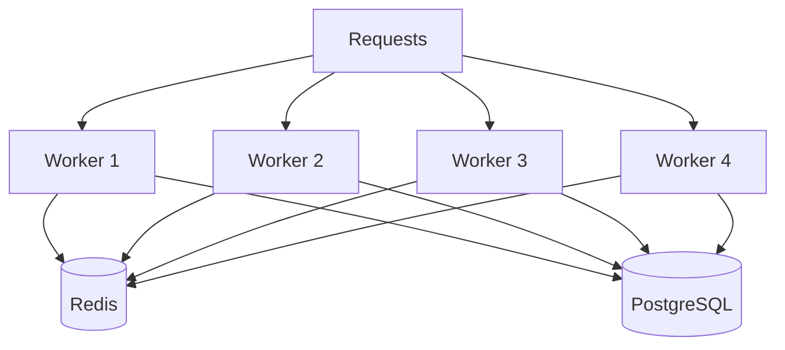

The four-worker configuration produced the strongest measured cached benchmark.

---

# Database Connection Budgeting

More workers also mean more potential database connections.

For the benchmark configuration:

```text
PostgreSQL max_connections = 100

Application budget = 80
Reserve            = 20

Per worker:

pool_size     = 12
max_overflow  = 5

Maximum per worker = 17

4 workers × 17 = 68
```

This stays within the application connection budget.

### Why does this matter?

Increasing application workers without controlling database pools might move the bottleneck from FastAPI to PostgreSQL.

Scaling one layer requires considering the capacity of the next layer.

---

# Windows Benchmark Bottleneck

Initial high-concurrency tests ran on Windows.

The single-worker server remained stable through 100 VUs, then encountered Windows/Python `select()` socket descriptor limits at higher concurrency.

Instead of treating this as application failure, the runtime limitation was isolated.

High-concurrency benchmarking then moved to WSL/Linux-oriented testing.

This became an important project lesson:

```text
Benchmark
   ↓
Failure
   ↓
Inspect
   ↓
Application bottleneck?

OR

Environment bottleneck?
```

The distinction matters when interpreting performance results.

---

# Authentication and Security

ZePlay includes:

* Registration
* Email verification
* Login
* Logout
* Password reset
* Google authentication
* Protected routes
* Role-aware access
* Premium authorization
* Admin authorization

Authentication answers:

```text
Who are you?
```

Authorization answers:

```text
What are you allowed to do?
```

Both are required.

---

# Premium Media Protection

Frontend restrictions are not treated as security boundaries.

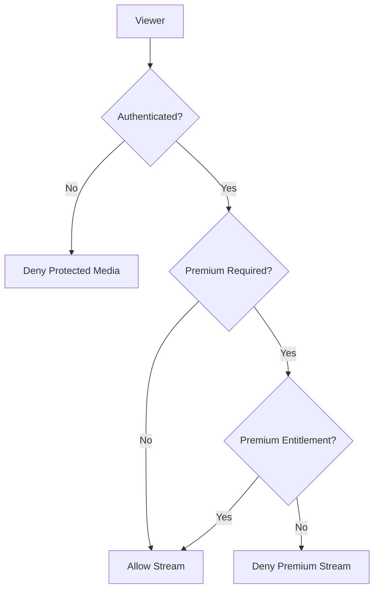

This prevents a free user from obtaining premium media by bypassing frontend controls.

---

# Watch History

Playback progress is persisted.

```text
Play
 ↓
Watch
 ↓
Save Progress
 ↓
Exit
 ↓
Return Later
 ↓
Resume
```

Watch history supports:

* Resume playback
* Continue Watching
* Viewing activity
* Recommendation signals

---

# Profiles

Profiles separate viewing state within an account.

Profile-linked data includes:

```text
Watch History
Watchlist
Ratings
Recommendations
Playback Progress
```

This keeps user-level authentication separate from viewer-level personalization.

---

# Search and Recommendations

ZePlay includes:

### Search

* Partial title matching
* Suggestions
* Genre filters
* Sorting
* Pagination

### Recommendations

* Trending
* Popular
* Personalized recommendations

Redis caches appropriate hot recommendation paths.

User-specific results remain tied to the authenticated profile where required.

---

# Admin Platform

Administrative workflows include:

* Movie management
* Metadata editing
* Video upload/import
* Poster upload
* Poster replacement
* Processing status
* Catalogue management

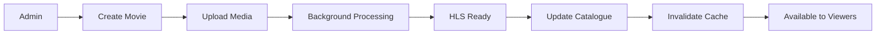

---

# Testing and Quality

ZePlay uses multiple validation layers.

<div align="center">

## 59 / 59 Backend Tests Passing

</div>

Testing covers major areas such as:

```text
Authentication
Catalogue
Profiles
Search
Recommendations
History
Watchlists
Ratings
Subscriptions
Storage
Workers
Media Access
```

Other validation includes:

### Streaming

* HLS playlists
* Segment requests
* Seeking
* ABR
* Manual quality
* Resume playback

### Performance

* k6
* PostgreSQL concurrency
* Redis behaviour
* Multi-worker scaling

### Database

* Query plans
* Index performance
* Data integrity
* Pagination

### Frontend

* Production builds
* Browser validation
* Player interactions
* Network inspection

---

# AI-Assisted Engineering

AI was used as part of the engineering workflow.

It assisted with:

* Codebase analysis
* Implementation
* Debugging
* Refactoring
* Test generation
* SQL analysis
* Performance investigation
* Benchmark interpretation
* Documentation

The workflow follows:

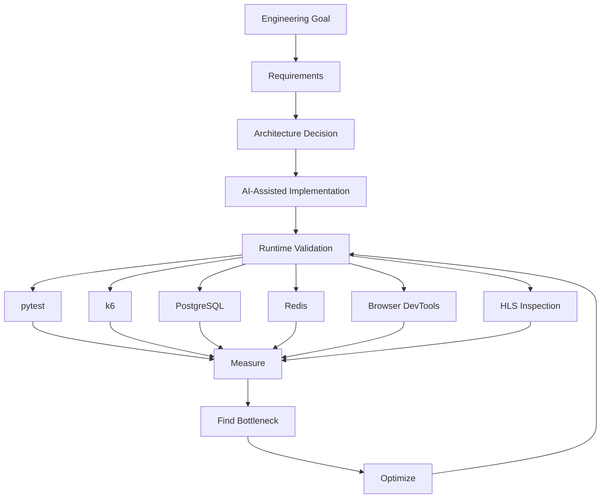

AI-generated implementation was not treated as proof of correctness.

Tests, runtime behaviour, query inspection, benchmarks, browser verification, and engineering review were used to validate changes.

---

# Technology Stack and Why

| Technology  | Role              | Why ZePlay Uses It                         | Alternative                 |
| ----------- | ----------------- | ------------------------------------------ | --------------------------- |
| React       | Frontend          | Component-based interactive UI             | Vue, Angular                |
| TypeScript  | Frontend language | Static typing and safer refactoring        | JavaScript                  |
| Vite        | Build tooling     | Fast development and production builds     | Webpack                     |
| React Query | Server state      | Caching, refetching, deduplication         | Manual fetch state          |
| HLS.js      | Video player      | Browser HLS + ABR control                  | Native HLS                  |
| Python      | Backend language  | FastAPI + media tooling ecosystem          | Java, Node.js               |
| FastAPI     | API framework     | Async APIs, validation, Python integration | Flask, Django, Express      |
| PostgreSQL  | Database          | Concurrency, transactions, indexing        | SQLite, MySQL, MongoDB      |
| SQLAlchemy  | ORM               | Maintainable Python DB layer               | Raw SQL                     |
| Alembic     | Migrations        | Repeatable schema evolution                | Manual SQL migration        |
| Redis       | Cache             | Shared low-latency cache                   | In-process cache, Memcached |
| FFmpeg      | Media processing  | Mature transcoding and HLS tooling         | GStreamer                   |
| FFprobe     | Media inspection  | Reliable video metadata                    | Custom parsing              |
| H.264       | Video codec       | Broad playback compatibility               | H.265, AV1                  |
| AAC         | Audio codec       | Broad HLS compatibility                    | Opus                        |
| HLS         | Streaming         | Segments, ABR, CDN compatibility           | MPEG-DASH, MP4              |
| k6          | Load testing      | Reproducible VU benchmarks                 | Locust, JMeter              |
| pytest      | Backend testing   | Python-native automated testing            | unittest                    |

---

# Why Not Direct MP4?

```text
DIRECT MP4

Viewer
  ↓
Large Video File
```

Simple, but limited for ZePlay's requirements.

```text
HLS

Viewer
  ↓
Master Playlist
  ↓
Quality Variant
  ↓
Small Segments
```

HLS gives ZePlay:

* Adaptive quality
* Efficient seeking
* Segment caching
* Network adaptation
* CDN-ready delivery

---

# Why Redis Instead of Only PostgreSQL?

PostgreSQL is the source of truth.

Redis is the performance layer.

```text
PostgreSQL
    │
    └── Durable relational data


Redis
    │
    └── Fast temporary/cache data
```

Using PostgreSQL for every repeated hot read would add unnecessary database work.

Using Redis as permanent storage for core catalogue/account data would sacrifice the relational durability guarantees ZePlay requires.

They solve different problems.

---

# Why PostgreSQL Instead of MongoDB?

ZePlay contains strongly relational data.

```text
User
 ├── Profiles
 │    ├── History
 │    ├── Watchlist
 │    └── Ratings
 │
 └── Subscription

Movie
 ├── Genres
 ├── Videos
 └── Ratings
```

MongoDB is a strong document database.

PostgreSQL fits ZePlay better because relationships, transactions, constraints, joins, and indexing are central to the application model.

---

# Why Python Instead of Java?

Java with Spring Boot would be a strong choice for a large production backend.

ZePlay selected Python because the project combines:

```text
FastAPI
SQLAlchemy
Testing
Automation
FFmpeg orchestration
Background processing
```

in one ecosystem.

Python reduced development overhead while supporting the performance targets required for this project.

The choice is based on project requirements, not on Java being inferior.

---

# Production Architecture Direction

The validated project currently focuses on application and streaming architecture.

The production direction separates bulk media delivery from application APIs.

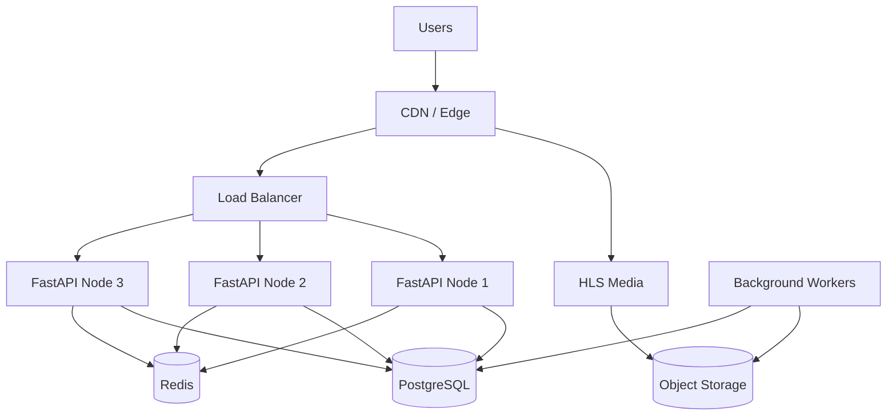

For AWS, this direction maps to:

```text
Object Storage → S3
CDN            → CloudFront
```

AWS deployment should not be confused with local architecture already validated.

---

# Why Object Storage?

Application server disks do not scale cleanly across multiple API instances.

```text
API 1 → local disk A
API 2 → local disk B
API 3 → local disk C
```

Media availability becomes tied to individual machines.

Object storage provides shared media storage independent of application instances.

PostgreSQL stores media references.

Object storage stores the media itself.

---

# Why CDN?

Without a CDN:

```text
10,000 Viewers
      ↓
    Origin
```

The origin repeatedly serves popular media segments.

With a CDN:

```text
Origin
  ↓
Edge Cache
  ↓
Viewers
```

Popular segments are delivered closer to users while origin traffic decreases.

CloudFront is the planned AWS-oriented option because it integrates naturally with S3.

Cloudflare, Fastly, and Akamai are valid alternatives.

---

# Horizontal Scaling

Vertical scaling:

```text
1 Server
   ↓
More CPU
More RAM
```

Horizontal scaling:

```text
Server 1
Server 2
Server 3
Server 4
```

ZePlay's production architecture targets stateless API instances so additional nodes can be added behind a load balancer.

Shared state belongs in:

```text
PostgreSQL
Redis
Object Storage
```

rather than one API process.

---

# Project Evolution

```mermaid
flowchart LR

    A[Core Platform]
    --> B[Authentication]
    --> C[Profiles]
    --> D[History]
    --> E[Search]
    --> F[Recommendations]
    --> G[Redis]
    --> H[PostgreSQL]
    --> I[HLS]
    --> J[ABR]
    --> K[Background Processing]
    --> L[Security]
    --> M[100K Catalogue]
    --> N[DB Optimization]
    --> O[k6]
    --> P[Cache Optimization]
    --> Q[Multi-Worker Scaling]
```

ZePlay was developed incrementally.

Each completed stage exposed the next engineering constraint.

---

# Implemented and Validated

* React frontend
* TypeScript
* Vite
* FastAPI
* PostgreSQL
* SQLAlchemy
* Alembic
* Redis
* Authentication
* Profiles
* Search
* Recommendations
* Watch history
* Continue Watching
* Watchlists
* Ratings
* Subscription logic
* Premium media authorization
* Admin management
* FFmpeg
* FFprobe
* HLS
* HLS.js
* 480p
* 720p
* 1080p
* Adaptive bitrate
* Manual quality control
* Seeking
* Background media processing
* Poster processing
* Large-catalogue testing
* PostgreSQL indexing
* Keyset pagination
* Trigram search
* Redis caching
* Pre-serialized responses
* GZip compression
* k6 benchmarking
* Multi-worker scaling
* Automated backend tests

---

# Production Roadmap

```text
Current Engineering
        │
        ▼
Object Storage
        │
        ▼
CDN Delivery
        │
        ▼
Load Balanced API
        │
        ▼
Managed PostgreSQL
        │
        ▼
Managed Redis
        │
        ▼
Distributed Workers
        │
        ▼
Monitoring + Logging
        │
        ▼
CI/CD
        │
        ▼
Autoscaling
```

Potential later work includes:

* AWS S3
* CloudFront
* Managed PostgreSQL
* Managed Redis
* Production load balancing
* Distributed media workers
* Monitoring
* Centralized logging
* Metrics
* Alerting
* CI/CD
* Autoscaling

---

# Repository Structure

```text
ZePlay/
│
├── frontend/
│   ├── src/
│   │   ├── components/
│   │   ├── pages/
│   │   ├── hooks/
│   │   ├── services/
│   │   └── ...
│   │
│   ├── public/
│   └── package.json
│
├── backend/
│   ├── app/
│   │   ├── api/
│   │   ├── models/
│   │   ├── schemas/
│   │   ├── services/
│   │   ├── workers/
│   │   └── ...
│   │
│   ├── migrations/
│   ├── tests/
│   ├── storage/
│   ├── import_video.py
│   └── requirements.txt
│
├── docs/
│   └── images/
│       └── zeplay-overview.png
│
├── docker-compose.yml
├── DEPLOYMENT.md
└── README.md
```

Update this tree to match the current repository before publishing.

---

# Local Setup

## Requirements

```text
Python
Node.js
PostgreSQL
Redis
FFmpeg
```

k6 is required for performance benchmarking.

---

## Backend

```bash
cd backend

python -m venv .venv
```

Windows:

```bash
.venv\Scripts\activate
```

Linux / macOS:

```bash
source .venv/bin/activate
```

Install dependencies:

```bash
pip install -r requirements.txt
```

Apply migrations:

```bash
alembic upgrade head
```

Start FastAPI:

```bash
uvicorn app.main:app --reload
```

---

## Frontend

```bash
cd frontend
npm install
npm run dev
```

Production build:

```bash
npm run build
```

---

## Backend Tests

```bash
cd backend
pytest
```

Latest validated suite:

```text
59 passed
0 failed
```

---

## Load Testing

Example:

```bash
k6 run k6_load_test.js
```

Load-test results should always be interpreted together with the environment, worker count, database pool, cache state, latency distribution, and failure rate.

---

# Key Engineering Lessons

### Working is not the same as scaling.

A query that performs well against 17 movies might behave differently against 100,017.

### Caching does not automatically remove application work.

Serialization and validation still matter after a cache hit.

### More workers do not automatically mean more capacity.

Database connection pools must scale safely with worker count.

### Zero failures do not mean good performance.

A 1,000-VU test completed without request failures while tail latency became too high for a production target.

### Streaming is more than playing a video.

A streaming architecture must consider encoding, segmentation, quality variants, seeking, buffering, network adaptation, authorization, storage, and delivery.

### Benchmark the system instead of guessing.

ZePlay's optimization work followed:

```text
Measure
↓
Find Bottleneck
↓
Change One Layer
↓
Retest
↓
Compare
```

---

# Internship Context

ZePlay was developed as the flagship project of a Software Engineering Internship.

The project provided hands-on work across:

* Software engineering
* Frontend development
* Backend development
* Streaming systems
* Database engineering
* Caching
* Performance optimization
* Security
* Media processing
* Load testing
* System design
* Scalability
* Production architecture
* AI-assisted development

The project evolved from building product functionality into understanding how systems behave under increasing scale.

---

<div align="center">

# ZEPLAY

### Adaptive Streaming · Performance Engineering · System Design

Built as a Software Engineering Internship flagship project.

</div>
