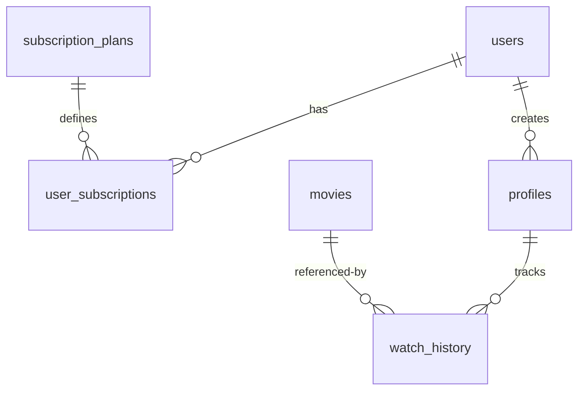

# ZePlay Master Memory & Permanent Knowledge Base

This document serves as the single source of truth for the ZePlay streaming platform. It provides a comprehensive engineering reference for future developers, administrators, supervisors, and AI agents.

---

## 1. Project Overview

- **Project Name**: ZePlay
- **Purpose**: A subscription-based, high-performance video streaming platform built to emulate modern Netflix-style media rendering, profile customization, and secure subscription gating.
- **Business Goal**: Deliver premium, low-latency video streaming experiences, drive paid subscriptions, and scale infrastructure cost-efficiently.
- **Target Users**: General entertainment consumers, family households requiring multi-profile management (including pin-gated adult and filtered kids profiles), and administrators managing media catalog ingestions.
- **Current Stage**: Hardening, Scalability, and Production Readiness Sprint.
- **Internship Objectives**: Upgrade database engines to production standards, implement asynchronous background architectures to optimize response latencies, secure client entitlements, and layout a high-performance AWS cloud-native target architecture.

---

## 2. System Architecture

ZePlay is designed around a modern client-server model, separating client presentation logic from database orchestration.

### Frontend
- **Framework**: React 18+ bootstrapped with Vite for fast build and reload cycles.
- **Language**: TypeScript (enforcing strong compile-time types).
- **Routing**: `react-router-dom` v6 for client-side routing.
- **State Management**: React Context API for global auth sessions, themes, and profile states.
- **Styling**: Vanilla CSS with HSL variables.

### Backend
- **Framework**: FastAPI (Python 3.12+) utilizing asynchronous ASGI servers.
- **ORM**: SQLAlchemy 2.0 with `asyncio` extension layers.
- **Migrations**: Alembic for database version history tracking.
- **Authentication**: JWT (JSON Web Tokens) with HS256 encryption.

### Database
- **Current DB**: SQLite (Local file DB used during early sprints and testing).
- **Target DB**: Amazon RDS PostgreSQL (using native UUID fields).

### Caching
- **Cache Engine**: Redis (Distributed key-value caching).

### Email Services
- **Client Provider**: Resend API (for transactional SMTP verification).

### Target Production Infrastructure (AWS)
- **Object Storage**: Amazon S3 (for adaptive HLS segments).
- **CDN**: Amazon CloudFront (caching video at edge nodes).
- **Compute**: AWS ECS (Fargate container clusters).

---

## 3. Completed Sprints (Sprints 1 - 10)

### Sprint 1: Foundation & Video Upload
- **Objective**: Setup web app framework and support raw MP4 uploads.
- **Features Built**: File storage engine, upload APIs, basic movie catalog listing.
- **Technical Decisions**: Stored uploads directly to filesystem paths.
- **Lessons Learned**: VPS filesystem directories are ephemeral; production needs cloud object storage.

### Sprint 2: User Authentication
- **Objective**: Implement login, register, and JWT tokens.
- **Features Built**: Registration forms, login endpoints, password hashing (bcrypt).
- **Lessons Learned**: Synchronously sending validation emails blocks API response cycles.

### Sprint 3: Watchlist & Favorites
- **Objective**: Let users bookmark content.
- **Features Built**: Watchlist tables, add/remove endpoints.
- **Technical Decisions**: Used join tables with composite primary keys.

### Sprint 4: Rating System
- **Objective**: Capture user feedback.
- **Features Built**: 5-star ratings, reviews.
- **Lessons Learned**: Database engines require row-level locking to prevent write blocks on ratings.

### Sprint 5: Profiles & Kids Filter
- **Objective**: Support multi-profile family accounts.
- **Features Built**: Profile CRUD, kids content filter.
- **Lessons Learned**: Gating profiles requires robust sub-authentication layers.

### Sprint 6: PIN-Lock Security
- **Objective**: Gate adult profiles from children.
- **Features Built**: Profile PIN-locks, session-based profile verification.

### Sprint 7: Continue Watching & Playback Progress
- **Objective**: Auto-resume video playback from previous timestamps.
- **Features Built**: Resume APIs, playback progress tables.

### Sprint 8: Search & Suggestions
- **Objective**: High-performance catalog searching.
- **Features Built**: Trie-based autocomplete suggestions, search indexes.

### Sprint 9: Subscription Engine
- **Objective**: Tiered content access.
- **Features Built**: Free/Premium plan tables, profile limits, billing portals.
- **Technical Decisions**: Implemented UUID columns for subscription references.

### Sprint 10: Video Transcoding & HLS
- **Objective**: Netflix-style adaptive stream preparation.
- **Features Built**: FFmpeg background transcoding pipelines, HLS segmenting.

### Sprint 11A: Local ABR & PostgreSQL Migration Verification
- **Objective**: Execute database migrations against PostgreSQL dialect, implement multi-bitrate HLS structure, and write Locust load testing configs.
- **Features Built**: ABR playlist index master.m3u8, 480p/720p/1080p transcoder tasks, autocomplete suggestion caching, and locustfile.py suite.

---

## 4. Feature Inventory

| Feature | Purpose | Current Status | Dependencies |
| :--- | :--- | :--- | :--- |
| **Authentication** | Secure user registration and session management. | Production Ready | JWT, Bcrypt |
| **Profiles** | Multi-account setups on a single subscription. | Production Ready | User Model |
| **PIN Protection** | Protects adult profiles from child access. | Production Ready | Profiles |
| **Subscriptions** | Gates premium content. | Production Ready | PostgreSQL UUIDs |
| **Ratings** | Collects user star feedback. | Production Ready | Movie Model |
| **Recommendations** | Surfaces popular/trending content. | Caching Optimised | Redis, Database |
| **Search** | Finds movies. | Autocomplete Active | Catalog Service |
| **Watch History** | Tracks user viewing history. | Production Ready | Movie, Profile |
| **Movie Uploads** | Admins ingest new media. | Active | FFmpeg, Async Session |
| **Video Processing** | Translates MP4 to HLS. | HLS Master Linked | FFmpeg, BackgroundTasks |

---

## 5. Database Documentation



- **UUID Strategy**: Primary and foreign keys for `SubscriptionPlan`, `UserSubscription`, and `Profile` use native UUID types to prevent primary key sequence overlaps during PostgreSQL migrations.
- **Migration History**:
  - `i108k76k907j`: Base profile and auth models.
  - `j109l87l018k`: Subscription and Plans tables (UUID aligned).
  - `k110m98m109l`: Video status and processing tracks.

---

## 6. API Documentation

### Authentication
- `POST /api/auth/register`: Creates new user account.
- `POST /api/auth/login`: Issues JWT bearer access token.
- `POST /api/auth/forgot-password`: Generates reset token.

### Profile
- `POST /api/profiles/`: Creates a profile (enforces plan constraints).
- `GET /api/profiles/`: Lists all profiles for user.
- `POST /api/profiles/{id}/verify-pin`: Unlocks pin-gated profiles.

### Subscription
- `GET /api/subscription/plans`: Lists all available plans.
- `GET /api/subscription/current`: Returns active subscription.
- `POST /api/subscription/upgrade`: Upgrades plan to premium.
- `POST /api/subscription/downgrade`: Downgrades plan to free.

### Catalog
- `GET /api/catalog/movies/{movie_id}`: Fetches movie details (entitlement protected).
- `POST /api/videos/admin/upload`: Ingests video (admin only).

---

## 7. Deployment History & Root Cause Analysis

### 1. CORS Wildcard Collision
- **Root Cause**: Enabling `allow_credentials=True` alongside wildcard allowed origins (`allow_origins=["*"]`) triggers browser security violations, blocking frontend requests.
- **Fix**: Replaced wildcard with explicit server-side arrays containing dynamic Vite domains and `settings.FRONTEND_URL`.

### 2. SQLite Integer Coercion
- **Root Cause**: SQLite features dynamic typing affinity. When inserting UUID hexes containing only numbers (`00000000-0000-0000-0000-000000000001`), SQLite converted it into integer `1`, causing SQLAlchemy UUID conversion errors.
- **Fix**: Redefined seed/test UUID values to start with non-numeric chars (e.g. `f0000000-0000-...`), forcing SQLite to treat them as `TEXT`.

### 3. SMTP Sync blocking
- **Root Cause**: Registration API response times spiked to 2+ seconds due to synchronous Resend/SMTP email triggers.
- **Fix**: Refactored email triggers into FastAPI `BackgroundTasks`.

---

## 8. Current Known Issues & Technical Debt

1. **Local Media File Serving (Current Debt)**: Adaptive HLS segments are saved directly to host VPS disk folders. They should be offloaded to cloud object storage.
2. **Synchronous Transcoding Block**: Processing high-resolution movies using local FFmpeg inside the app container can max out host CPU. Long-term solution requires delegating processing to AWS Elastic Transcoder or AWS Elemental MediaConvert.
3. **Caching Granularity**: Cache invalidation for recommendations does not listen to catalog updates immediately.

---

## 9. Scalability Roadmap

```
  [ User Client ]
         │
         ▼
  [ AWS CloudFront CDN ] ──── (Serves cached HLS segments & playlists)
         │
         ▼
  [ Application Load Balancer ]
         │
         ▼
  [ ECS Fargate Containers ] (Stateless FastAPI backend instances)
    ├── Reads / Writes
    │      ▼
    │  [ Aurora PostgreSQL (RDS) ]
    │
    └── Caches Queries
           ▼
       [ ElastiCache Redis ]
```

---

## 10. Netflix-Style Streaming Roadmap

```
[ Upload MP4 ] ──> [ FFmpeg Engine ] ──> [ Adaptive Bitrate Transcode ]
                                                    │
                                                    ▼
[ CDN Edge Cache ] <── [ S3 Storage Bucket ] <── [ HLS Master Playlist ]
```

- **Why HLS?**: Breaks video files into short, easily cacheable chunks, preventing massive file buffering.
- **Why ABR?**: Dynamically matches playback quality to user network conditions (3G/4G/WiFi) by providing multiple resolution profiles.
- **Why S3 & CDN?**: Offloads all heavy video traffic from server compute nodes directly to geographical caches.

---

## 11. Internship Defense Notes

* **Why PostgreSQL?**: Avoids database write locks via Multi-Version Concurrency Control (MVCC), accommodating thousands of write-heavy events (ratings, history tracking).
* **Why Redis?**: Reduces response time for read-intensive requests (popular media listings) to sub-2 milliseconds, preventing database bottlenecks.
* **Why HLS & CloudFront?**: Allows smooth playback on low-bandwidth networks (like 3G/4G) and reduces hosting egress fees by caching segments close to users.

---

## 12. Future Development Rules

1. **Stateless Operations**: Server instances must never save local application states. All state coordinates must reside in PostgreSQL or Redis.
2. **Type Enforcement**: All database primary and foreign keys must use `UUID(as_uuid=True)` instead of incremental integers or raw strings.
3. **Non-Blocking API Calls**: Any external integration (email delivery, transcoding, heavy file reads) must occur in background jobs.
